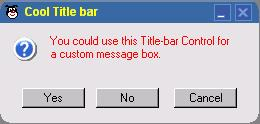



## DM TitleBar ActiveX Control

### Description

Hi this is a small activex control i made about 4 weeks ago and forgot all about so here it is it is a custom titlebar i made that you can change the skins around and do other things I found it usfull for message boxes you can also alter the skin form innside the skin folder just look at the ini file anyway please vote it you like it.
 
### More Info
 

             |
---                |---
**Submitted On**   |2001-10-02 17:43:36
**By**             |[dreamvb](https://github.com/Planet-Source-Code/PSCIndex/blob/master/ByAuthor/dreamvb.md)
**Level**          |Intermediate
**User Rating**    |4.8 (62 globes from 13 users)
**Compatibility**  |VB 6\.0
**Category**       |[Custom Controls/ Forms/  Menus](https://github.com/Planet-Source-Code/PSCIndex/blob/master/ByCategory/custom-controls-forms-menus__1-4.md)
**World**          |[Visual Basic](https://github.com/Planet-Source-Code/PSCIndex/blob/master/ByWorld/visual-basic.md)
**Archive File**   |[DM\_TitleBa515581282002\.zip](https://github.com/Planet-Source-Code/dreamvb-dm-titlebar-activex-control__1-31273/archive/master.zip)

